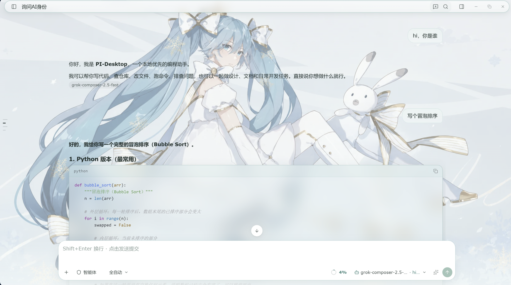
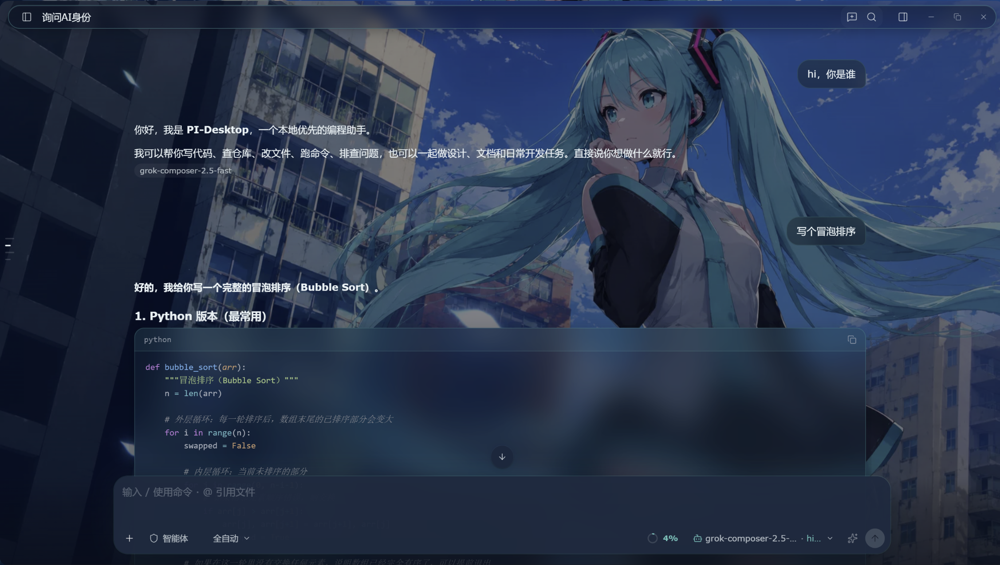

# pi-desktop-skin

一款为 [PI-Desktop](https://github.com/) 打造的皮肤主题插件，以初音未来（Hatsune Miku）为设计灵感，提供 **亮色** 与 **暗色** 两套完整主题。

主题基于宿主的 `--ds-*` 设计令牌全面覆盖，包括三栏背景、侧栏渐变光效、四级文字灰度、强调色与焦点环、hover / 选中态、开关、代码块、遮罩、状态色、阴影、滚动条、文字选区、输入胶囊辉光，以及原生窗口底色，视觉风格统一、低调克制。

## ✨ 主题一览

| 主题 | 模式 | 风格 |
| ---- | ---- | ---- |
| Snow Miku（初音 · 亮） | 浅色 | 雪白 × 冰蓝 × 沉稳 Teal `#14A39A`，白日使用清爽不刺眼 |
| Cyber Diva（初音 · 暗） | 深色 | 深夜蓝黑基底 × 霓虹 Miku Teal `#39C5BB`，克制的辉光与 hairline 描边 |

## 🖼 效果图

**Snow Miku（亮色主题）** —— 雪白与冰蓝交织的清新配色，搭配雪 Miku 主题壁纸，白天使用明亮通透、长时间码字也不刺眼：



**Cyber Diva（暗色主题）** —— 深夜蓝黑基底配霓虹 Teal 点缀，暗光环境下沉浸专注，代码块与输入框呈现出克制的辉光质感：



## 📦 使用方法

### 安装

1. 将本仓库克隆到本地：

   ```bash
   git clone https://github.com/<your-username>/pi-desktop-skin.git
   ```

2. 打开 PI-Desktop，进入 **Plugins（插件）** 页面，点击 **Load development plugin（加载开发插件）**。

3. 选择仓库中的 `miku-theme` 目录，PI-Desktop 会自动加载该插件；之后修改插件目录内的文件时，PI-Desktop 会即时热重载。

   > 也可以先打包再安装：在 `miku-theme` 目录下执行 `pnpm pi-plugin check .` 校验、`pnpm pi-plugin pack .` 打包，然后在 **Plugins** 页面安装生成的 `.piplug` 文件，体验与正式用户一致的安装流程。

### 启用

4. 打开 PI-Desktop 的 **设置 → 外观 → 主题**。

5. 在主题列表中选择：

   - **Snow Miku（初音 · 亮）** —— 启用亮色主题；
   - **Cyber Diva（初音 · 暗）** —— 启用暗色主题。

6. （可选）在命令面板中执行 **Miku Theme: Open Panel**，查看主题的说明面板。

主题即选即用，无需重启；随时可在同一位置切换亮色 / 暗色主题。

## 📁 目录结构

```
miku-theme/
├── manifest.json            # contributes.themes + windowAppearance，权限 ui.theme
├── main.js                  # 注册说明面板命令
├── themes/
│   ├── cyber-diva.css       # 暗色主题
│   ├── snow-miku.css        # 亮色主题
│   └── assets/              # 主题壁纸资源
└── renderer/index.html      # 说明面板页面
```

 ## ⚠️ 免责声明 / Disclaimer
 
 本项目中的壁纸及图片素材均来自网络，仅用于学习和个人美化用途，版权归原作者所有。
 如有侵权，请通过 [Issues](https://github.com/cainiao0502/pi-desktop-skin/issues) 联系我，我会第一时间删除相关内容。
 
 All wallpapers and image assets in this project are collected from the Internet and are for learning and personal customization purposes only. Copyright belongs to the original authors. If any content infringes your rights, please open an issue and it will be removed immediately.
 
## 📄 License

[MIT](LICENSE)
